# SyriaTel-Customer-Churn-Classifier
### Overview
Customer acquisition is very costly to businesses, especially in the telecom industry, therefore customer retention is paramount for a business to be successful. Finding ways to retain existing customers is more cost effective than acquiring new customers. This project aims to build a classification model that will predict whether a customer will soon stop doing business with SyriaTel, and suggest measures to reduce customer churn rate.

By developing multiple classification models, Syriatel will be able to determine the factors that increase customer churn rate and proactively employ methods that will improve customer retention.

### Problem Statement

This project aims to conduct a thorough analysis of the SyriaTel customer churn data, utilizing multiple classification modeling techniques. The primary goal is to uncover insights into the factors influencing customer churn for SyriaTel, and suggest proactive measures to reduce the churn rate.

### Stake Holders

This project targets a diverse audience:

- **SyriaTel**: SyriaTel's gain is to increase revenue by reducing customer churn rate, which in turn lowers customer acquisition cost. The marketting team can specifically target these customers.

- **Third-party Consultants**:  Companies and consultants seeking data-driven insights into customer retention in the Telecommunication industry can utilize these classification models.

## Objectives:

1. **Assess the Factors/Features Impacting Customer Churn the Most:**
   - Analyze the Syritel churn data and determine the features that impact customer churn rate the most. These will provide measures that Syritel can implement proactively to improve customer retention.
2. **Suggest Proactive Measures to Reduce Customer Churn Rate:**
   - Suggest proactive measures by assessing the features that make customers likely to stop doing business with SyriaTel, the company can then target these customers with these measures and improve retention.

3. **Develop a Classification Model to Predict SyriaTel's Customer Churn:**
   - Build and evaluate multiple classification models using the best features to predict when a customer will likely stop doing business with SyriaTel. Provide stakeholders with a predictive tool for estimating customer churn at Syriatel.
## Business Understanding
This project addresses the core business issue of customer retention in a telecom company. Key stakeholders such as telecom companies and consultants are focused on gaining insights into the factors that influence customer churn rate, enabling them to make pro-active, data-driven decisions to improve customer satisfaction.
## Data Understanding
I've used the SyriaTel Customer Churn Dataset. The data represents details about SyriTel's customers and sets the churn feature to true or false. Through analysis of the other features, we'll gain insight into what affects the churn column/feature. 

### Summary of Features/Columns in the SyriaTel Customer Churn Datset
* **state:** the state the customer lives in
* **account length:** the number of days the customer has had an account
* **area code:** the area code of the customer
* **phone number:** the phone number of the customer
* **international plan:** true if the customer has the international plan, otherwise false
* **voice mail plan:** true if the customer has the voice mail plan, otherwise false
* **number vmail messages:** the number of voicemails the customer has sent
* **total day minutes:** total number of minutes the customer has been in calls during the day
* **total day calls:** total number of calls the user has done during the day
* **total day charge:** total amount of money the customer was charged by the Telecom company for calls during the day
* **total eve minutes:** total number of minutes the customer has been in calls during the evening
* **total eve calls:** total number of calls the customer has done during the evening
* **total eve charge:** total amount of money the customer was charged by the Telecom company for calls during the evening
* **total night minutes:** total number of minutes the customer has been in calls during the night
* **total night calls:** total number of calls the customer has done during the night
* **total night charge:** total amount of money the customer was charged by the Telecom company for calls during the night
* **total intl minutes:** total number of minutes the user has been in international calls
* **total intl calls:** total number of international calls the customer has done
* **total intl charge:** total amount of money the customer was charged by the Telecom company for international calls
* **customer service calls:** number of calls the customer has made to customer service
* **churn:** true if the customer terminated their contract, otherwise false

### Feature Selection
For feature selection, I'll first divide the dataset features into continous and categorical features.

#### Continuous Features:
* account length
* number vmail messages
* total day minutes
* total day calls
* total day charge
* total eve minutes
* total eve calls
* total eve charge
* total night minutes 
* total night calls
* total night charge
* total intl minutes
* total intl charge
* customer service calls

#### Categorical Features:
* churn
* state
* area code
* international plan
* voicemail plan

#### Categorical Features Analysis
#### Analysis 1: Explore the Impact of Categorical Features on Customer Churn:
This section analyzes the impact of the categorical features(state, area code, international plan, voicemail plan) on the target feature (churn).

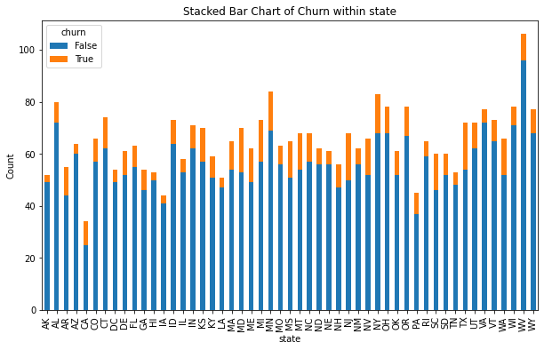
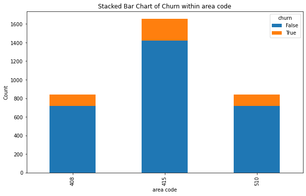
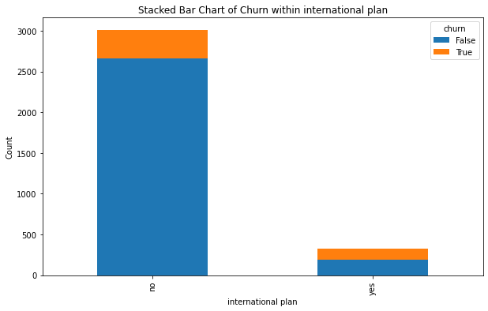
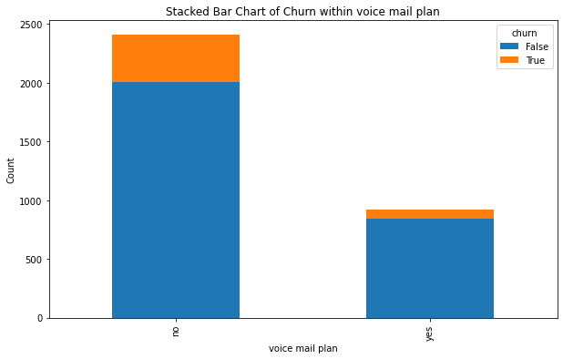

**Observation:**

 From the visualizations above, 42% of the customers with an international plan left SyriaTel in comparison to 11% of those that don't have an international plan. Syriatel should focus on boosting international calls to improve customer satisfaction for those with international plans.

The customer churn for those without a voice mail plan is higher than the customers with a plan, at 16% versus 8%. There is no impact of area codes on customer churn, though 50% of the data is from Area code 415.
#### Numeric Features Analysis
#### Analysis 2: Explore the Impact of Numeric Features on Customer Churn:

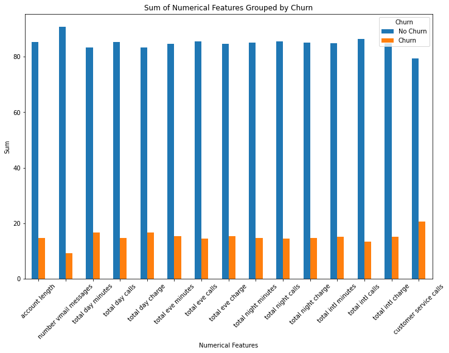

**Observation:**

From the chart above, the most significant numeric value on customer churn is customer service calls. Customers with more service call are more likely to discontinue their service with SyriaTel.
### Correlation Heatmap for Numeric Features

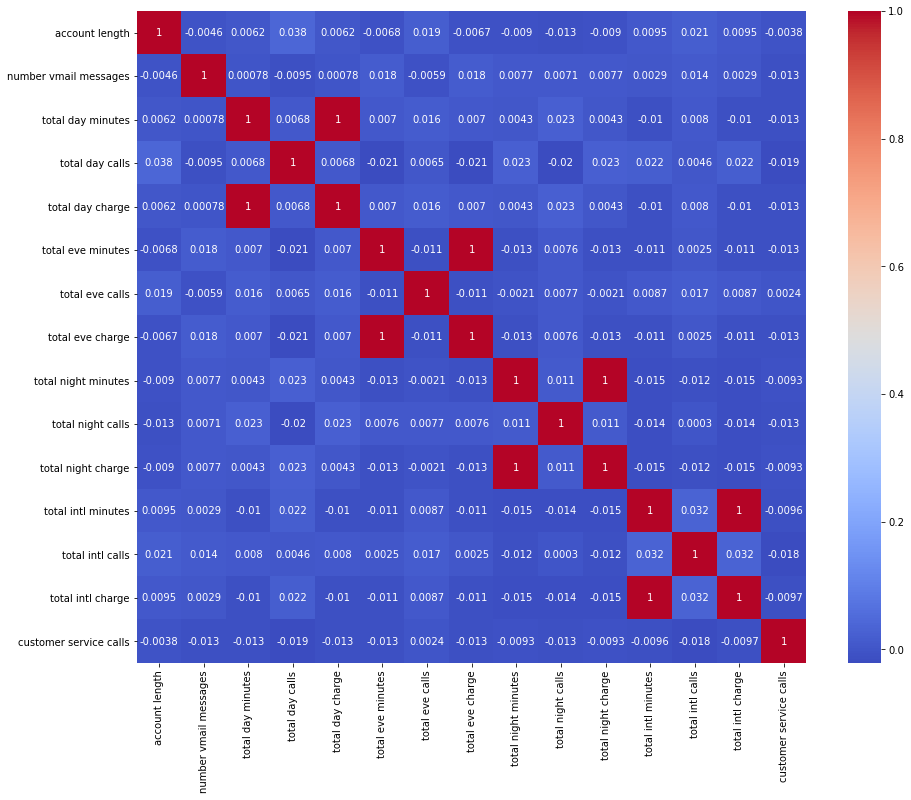

Some of the numeric features have perfect correlation since the values in one column are derived from the other column:

* Total day charge and total day minutes.
* Total eve charge and total eve minutes.
* Total night charge and total night minutes. 
* Total intl charge and total intl minutes. 

I'll drop the columns with minutes and remain with the columns with charges.

### Train-Test Split 
#### Split the data into training and testing data at 80,20 ratio

### Preprocessing
I've used onehotencoder to convert each categorical value into a new binary column with 0 or 1 for each unique value.

### Normalization
I've use Minmax scaler to scale the numeric data in the dataset then joined the numeric and categorical data.

### Addressing Class Imbalance
The binary classes in the target feature (churn) are not evenly distributed as illustrated below.

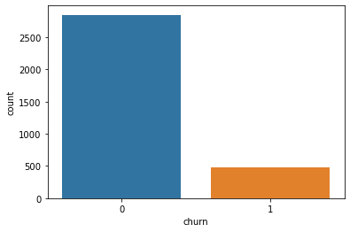

* 14.5% of the data in the churn feature is true, this shows class imbalance which I will address using SMOTE, an oversampling technique.
 
 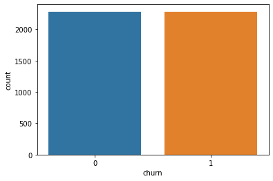

## Modelling
***
### Model 1 : Logistic Regression Classifier

* Logistic Regression is a type of classification algorithm under supervised machine learning that predicts the probability of a classification outcome based on one or more predictor variables.In this project, the target variable(churn) is binary, either true or false.
* This will serve as the base model.

#### Model Evaluation

#### Observations

* **Accuracy:** The model correctly predicted 78.7% of the instances in the testing set. This is a decent overall performance.
* **F1-score:** The F1-score of 0.52 indicates a moderate balance between precision and recall. It's lower than the accuracy, suggesting there might be some trade-off between these two metrics.
* **Recall:** The high recall of 0.762 means the model is good at identifying most of the positive instances, but it might also incorrectly classify some negative instances as positive.
* **Precision:** The low precision of 0.395 suggests that the model incorrectly classifies many negative instances as positive, as shown by the low pecision score on the True(1) class.
#### Conclusion

* Recall is the most significant metric, since the goal is to identify customers about to leave and implement proactive measures to prevent that. Precision is also important to ensure that retention efforts are not wasted on customers unlikely to churn.
* This model wouldn't be ideal to predict customer churn.
***
### Model 2 : Decision Trees Classifier

* Decision tree classifier is a supervised machine learning algorithm that works by splitting the data into subsets based on the value of input features.
* Each node represents a decision rule, and each branch represents an outcome of that rule.

#### Model Evaluation

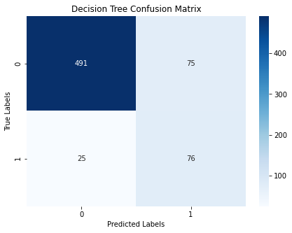

#### Observations

* **Accuracy:** The model correctly predicted 85% of the instances in the testing set. This is a good overall performance, and improved compared to logistic regression model.
* **F1-score:** The F1-score of 0.603 indicates a moderate balance between precision and recall. It's lower than the accuracy, suggesting there might be some trade-off between these two metrics.
* **Recall:** The high recall of 0.752 means the model is good at identifying most of the positive instances, but it might also incorrectly classify some negative instances as positive.
* **Precision:** The improved precision score of 0.503 is moderate, indicating that while the model is good at identifying positive instances, it might also incorrectly classify some negative instances as positive.
#### Conclusion

* Overall performance of the decision tree model has improved compared to logistic regression.
* The model is still struggling to identify positive instances of the churn feature, customers who have left the business.
***
### Model 3 : Random Forest Classifier
* Random forest is a supervised machine learning algorithm that creates a set of decision trees from a randomly selected subset of the training data.
* Random forest is best suited for handling large, complex datasets and providing insight into feature importance.

#### Model Evaluation

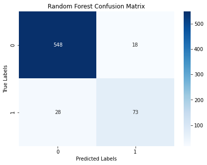

#### Observations

* **Accuracy:** The model correctly predicted 93.1% of the instances in the testing set, which is an excellent overall performance, and an improvement compared to the Decision Tree model.
* **F1-score:** The F1-score of 0.76 indicates a good balance between precision and recall. It's lower than the accuracy, suggesting there might be some trade-off between these two metrics.
* **Recall:** The recall of 0.723 is moderate, meaning the model might miss some positive instances. This is a slight decline compared to Decision tree.
* **Precision:** The precision score of 0.802 is significantly improved, but still indicates that the model might incorrectly classify some negative instances as positive.
#### Hyperparameter Tuning of Random Forest Classifier
* Classifier models can be optimized by tweaking the classifier's parameters. To improve the performance of the random forest classifier, I've changed some parameters.

#### Observations

One of the most important parameters to improve precision score is class_weight, which addresses class imbalance. 

* **Accuracy:** The model's accuracy has improved to 93.7%.
* **F1-score:** The model's F1-Score has improved to 0.784.
* **Recall:** The model's Recall has improved to 0.752.
* **Precision:** The precision score has improved from 0.794 to 0.817.
#### Feature Importance

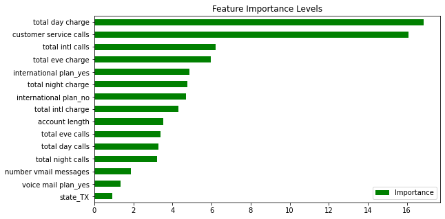

#### Observations : Feature Importance

The Top three features that most impact the customer churn feature are:
1. Total day charge
2. Customer Service calls
3. Total International calls

#### Conclusion

* Overall performance of the Random forest is better compared to the logistic regression and decision tree classifiers.
* The key metric, precision, has significantly improved but is at a moderate score of 0.794. The model is incorrectly classifying negative instances as positive.
### Models Comparison
#### ROC Curve and AUC 

* ROC curve illustrates the true positive rate (recall) against the false positive rate of a classifier. AUC represents a measure of the overall ability of the classifier to distinguish between positive and negative classes.
* The higher the AUC, the better the performance. The best performing model will have an ROC that hugs the upper left corner of the graph, illustrating a high true positive rate and low false positive rate.

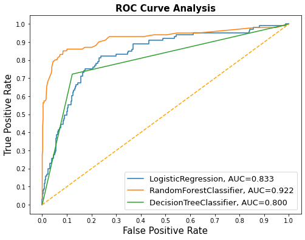

* From the ROC and AUC value illustrated above, the best performing model is the Random Forest Classifier. This model will best predict the customers about to leave the business.
## CONCLUSION
### Objective 1: 

#### Assess the Factors/Features Impacting Customer Churn:

**Conclusion:**
- **Findings:** Through feature analysis, the most impactful features on customer churn are: total day charge, customer service calls, international plan and total international calls.
- **Implications:** These features suggest that customers who feel overcharged, dissatisfied with international plans and unresolved issues leading to multiple customer service calls are the most likely to churn.

### Objective 2:
#### Suggest Proactive Measures to Reduce Customer Churn Rate:

**Conclusion:**
- **Findings:** An increase in customer service calls by a customer suggests that the customer is highly dissatisfied and likely to churn. An increase in total day charges, increases customer churn.
- **Implications:** Implement more effective and responsive customer service protocols to resolve customer complaints. Offer personalized subscriptions to customers as the daily charges increase. Improve international calls plan to boost customer satisfaction.

### Objective 3:
#### Develop a Classification Model to Predict SyriaTel's Customer Churn:

**Conclusion:**
- **Findings:** The tuned random forest classifier is the best model to predict customer churn, with an `AUC` score of `0.922` and an accuracy score of 93.7%.
- **Implications:** This random forest classifier can be used to predict when a customer is likely to churn based on multiple predictor variables. This will enable data-driven decisions to boost customer retention and targeted campaigns to improve customer satisfaction.
## Recommendations

1. **Focus on Boosting International Calls:**
   - Consider offering more tailored or flexible international plans that better match customer needs, possibly with options for additional benefits or reduced rates.

2. **Enhance Customer Support:**
   - Monitor customers who frequently contact support and proactively reach out to them to resolve potential issues before they escalate. Implement more effective and responsive customer service protocols.

3. **Use Data-Driven Insights to Target Dissatisfied Customers:**
   - Incorporate insights from predictive data analysis to come up with targeted campaigns for highly dissatisfied customers about to churn
